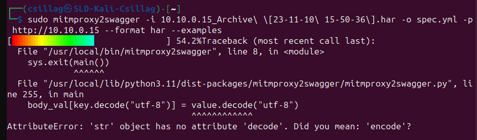

# API penetration testing

## Guide line
    1. Describe the structure of the current network and machine setups
    2. Reconnaissance - DEMO?
    3. Attack - DEMO
    4. Detection of penetration - DEMO
    5. Appropiate security measures
    
## Tools
    1. Offensive machine setup
        - Burp Suite
        - Postman
        - Foxyproxy
        - mitmproxy2swagger
        - kiterunner
        - gobuster
        - OWASP ZAP
        
## Documentation
1. Describe the structure of the current network and machine setups

    LAN: 10.10.24.0/24
    
    WAN: 10.10.0.0/24
    
    - Defensive machine (10.10.24.103)
        - crAPI install    
            Github repository: https://github.com/OWASP/crAPI	
            
            Docker install:
                Docker is a platform that enables developers to automate the deployment of applications within lightweight, portable containers.
               
                `$ sudo apt install -y docker.io`
                `$ sudo systemctl enable docker –now`

        - change website’s IP address
             
             
            
            Finally, you need to rebuild the crapi-web container using the following command:
            
            `$sudo docker compose -f docker-compose.yml --compatibility up -d`
    
    - Firewall (10.10.24.1/10.10.0.15)
    
        - set a HAproxy
            
            
            
        - appropiate floating rules to HAproxy
            
            
            And now our website is available from WAN
        - allow ping
             
            
            
            
    - Offensive machine (10.10.0.138)
        - Foxyproxy
            
            It heps you configure your web browser to use a forward proxy. 
            
            Postman and Burp Suite have their own proxy, with Foxyproxy it is very easy to switch between them.
            
            
            
            
        - Add Burp Suite certificate to the browser (mitm proxy)
        - Install postman, mitmproxy2swagger, kiterunner, gobuster, OWASP ZAP
            
2. Reconnaissance - Demo
    - Nmap
        General detection:
            `nmap -sC -sV 10.10.0.15`
            
            
            
        All port scan:
            
            
            Check every port on browser
            
        Check a specific port's service:
            
            
   
    - Gobuster (directory brute-force)
        
        
    - Kiterunner (API endpoints)
        
        
        
    - Dev tool + mitmproxy2swagger
        Filter : api 
        
        
        
        Start capture everything on the website
        
        Network -> Settings -> Persist logs
        
        Use everything on the website
        
        Save the HAR file
        
        Create swagger file:
        
        `$ sudo mitmproxy2swagger -i crapi.har -o crapi.yml -p http://10.10.0.15 --format har` 
        
        
        
        
        
        

    - Swagger
        Check documentation        
        
         
        
    

            

