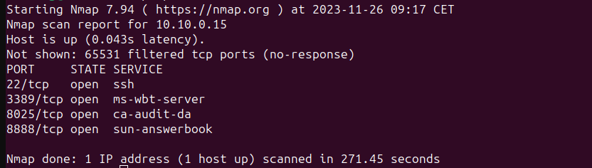
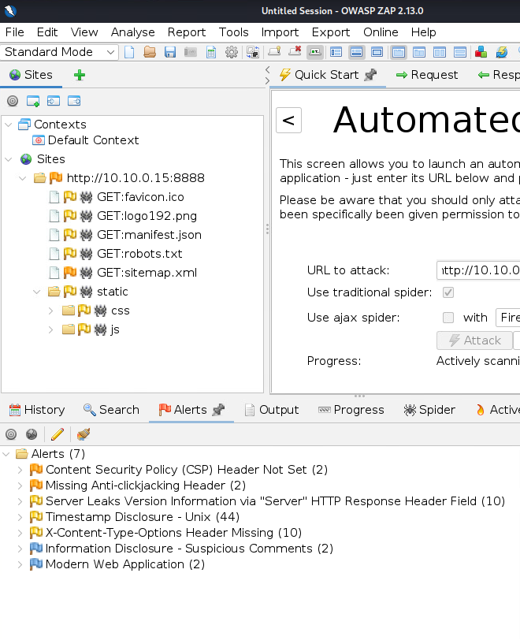

# API penetration testing

## Guide line
    1. Describe the structure of the current network and machine setups
    2. Reconnaissance - DEMO?
    3. Attack - DEMO
    4. Detection of penetration - DEMO
    5. Appropiate security measures
    
## Tools
    1. Offensive machine setup
        - Burp Suite
        - Postman
        - Foxyproxy
        - mitmproxy2swagger
        - kiterunner
        - gobuster
        - OWASP ZAP
        
    2. Defensive machine
        - docker 
        
## Documentation
1. Describe the structure of the current network and machine setups

    LAN: 10.10.24.0/24
    
    WAN: 10.10.0.0/24
    
    - Defensive machine (10.10.24.103)
        - crAPI install    
            Github repository: https://github.com/OWASP/crAPI	
            
            Docker install:
                Docker is a platform that enables developers to automate the deployment of applications within lightweight, portable containers.
               
                `$ sudo apt install -y docker.io`
                `$ sudo systemctl enable docker –now`

        - change website’s IP address
             
             
            
            Finally, you need to rebuild the crapi-web container using the following command:
            
            `$sudo docker compose -f docker-compose.yml --compatibility up -d`
    
    - Firewall (10.10.24.1/10.10.0.15)
    
        - set a HAproxy
            
            
            
        - appropiate floating rules to HAproxy
            
            
            And now our website is available from WAN
        - allow ping
             
            
            
            
    - Offensive machine (10.10.0.138)
        - Foxyproxy
            
            It heps you configure your web browser to use a forward proxy. 
            
            Postman and Burp Suite have their own proxy, with Foxyproxy it is very easy to switch between them.
            
            
            
            
        - Add Burp Suite certificate to the browser (mitm proxy)
        - Install postman, mitmproxy2swagger, kiterunner, gobuster, OWASP ZAP
            
2. Reconnaissance - Demo
    - Nmap
        General detection:
            `nmap -sC -sV 10.10.0.15`
            
            
            
        All port scan:
            
            
            Check every port on browser
            
        Check a specific port's service:
            
            
   
    - Gobuster (directory brute-force)
        
        
    - Kiterunner (API endpoints)
        
        
        
    - Dev tool + mitmproxy2swagger
        Filter : api 
        
        
        
        Start capture everything on the website
        
        Network -> Settings -> Persist logs
        
        Use everything on the website
        
        Save the HAR file
        
        Create swagger file:
        
        `$ sudo mitmproxy2swagger -i crapi.har -o crapi.yml -p http://10.10.0.15 --format har` 
        
        
        
        
        
        

    - Swagger
        Check documentation        
        
        
       
    - OWASP ZAP (vulnerability scanner)
        A generic vulnerability scan lead to a false-negative result, it can gives false secure feelings.
        
        Automated scanners detect API8:2023 Security Misconfiguration, e.g
            - cross-origin resource sharing policy is missing
            - transport layer security is weak or missing
            - verbose error messages 
        
        
        Unauthenticated scan - automated
        
        
        
        
        
        
        Authenticated scan can be done by manual explore
        
        
        
3. Attacks
- BOLA (Broken Object Level Authorization) + Excessive Data Exposure

    BOLA = access controls for resources (objects) are not properly implemented -> unauthorized access to a particular object or data manipulation
    
   - BOLA
        
       
   

   - BOLA + Excessive Data Exposure
   
    Go to 'Community' tab
    
    
    See GET request
   
   
   Copy it to Postman to see response
   
   
   
   When we go to a specific post, in the endpoint, we can see the user's ID and, as in the response the vehicle ID too
   
   
   
   Exploit BOLA by vehicle ID
   
   Now we can see where is a user's car
   
   
    
    
   - How to defense against BOLA, Excessive Data Exposure?
    
        -BOLA: 
            - use Least Privilege principle
            - RBAC 
            - validate user input
    
    
        -EDE: 
            - Test the body of API's response, the body should not contain any sensitive information
            
- MASS  ASSIGNMENT
    - Improper data management
    - API uses the same objects when creating and updating records -> privilege escalation, bypass built-in sec tools
    - 'user' object -> replay POST request: true isAdmin during user creation
        - name
        - email
        - isAdmind
        
    - Bank API example:
        API allows users to update the email address, but this vulnerability might let the user to send a request that updates their account balance
        
     
     
     
     
        
    - Defense: object validation
    
- PAYLOAD INJECTION
    - Weak input validation
    - Rule: never trust in user's input
    - Alter data to manipulate queries
    - Manipulate back-end database, see sensitive data, and may be able to delete or modify them 
    - Possible injection endpoints -> user inputs
    
    1. Use Burp Suite to capture the request and use Foxyproxy
    
    
    
    2. Load the injection patterns to the Payload Settings and uncheck URL-encoding, after start attack
    
    
    3. 422 Status
    
    
    4. Delete double quotes
    
    
    5.Get coupon code
    
    
    6. Apply coupon
    

        
    

            

